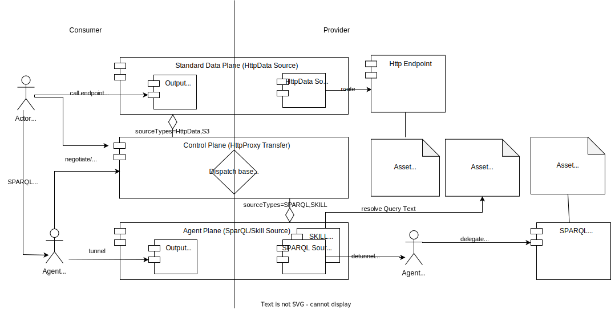

<!--
 * Copyright (c) 2022,2024 Contributors to the Eclipse Foundation
 *
 * See the NOTICE file(s) distributed with this work for additional
 * information regarding copyright ownership.
 *
 * This program and the accompanying materials are made available under the
 * terms of the Apache License, Version 2.0 which is available at
 * https://www.apache.org/licenses/LICENSE-2.0.
 *
 * Unless required by applicable law or agreed to in writing, software
 * distributed under the License is distributed on an "AS IS" BASIS, WITHOUT
 * WARRANTIES OR CONDITIONS OF ANY KIND, either express or implied. See the
 * License for the specific language governing permissions and limitations
 * under the License.
 *
 * SPDX-License-Identifier: Apache-2.0
-->

# Tractus-X Knowledge Agents EDC Extensions (KA-EDC) Documentation

In the Knowledge Agent Architecture, an Agent is any component which speaks and/or enacts a Semantic Web protocol, such as SPARQL.

The Tractus-X Knowledge Agents EDC Extensions (KA-EDC) introduces support for these protocols (and runnable applications) into the [Eclipse DataSpace Connector](https://github.com/eclipse-edc/Connector) and [Tractus-X EDC](https://github.com/eclipse-tractusx/tractusx-edc).

In particular, KA-EDC implements the so-called Matchmaking Agent endpoint that is able to discover and delegate to business data & functions provided by Binding Agents such as provided by [Knowledge Agents Reference Implementations (KA-RI)](https://github.com/eclipse-tractusx/knowledge-agents).

In contrast to the Binding Agents which are restricted to a subset of the full SPARQL protocol called the KA-BIND profile, KA-EDC implements the KA-MATCH and KA-TRANSFER profiles. The data upon which KA-EDC operates however consists of ontology information and the data catalogue of the respective dataspace tenant.

## How it works



KA-EDC works as a kind of tunnel/dispatched for federated Semantic Web queries:
- An Agent (a REST endpoint controller) is headed towards a consuming parties intranet applications and speaks a standard query protocol (here: SPARQL in a federated profile called KA-MATCH).
- The Agent talks to the (standard) EDC Control Plane to negotiate/initiate an HttpProxy transfer to a target asset (Graph). It also overtakes the role of the application to manage any resulting Endpoint Data References (EDR).
- On the data provider side, any backend data sources (speaking a simpler, non-federated SPARQL profile called KA-BIND) will be registered using a dedicated asset type (cx-common:Protocol?w3c:http:SPARQL).
- When a graph asset is requested by the Agent, the Control Plane will produce an EDR to the KA-EDC Agent plane which has been registered to handle the corresponding asset types.
- Using the EDR's, the Agent will tunnel the SPARQL request (using the KA-TRANSFER profile) through the Agent Plane(s) where it will not directly hit its final destination.
- Instead, the consumer-side Agent engine will become active to validate, perform preprocessing and finally delegate the simpler KA-BIND calls to the actual endpoints. 
- The scheme is also used to store special query assets (called Skills using the asset type cx-common:Protocol?w3c:http:SKILL) which operate as a kind of stored procedures.

When running an EDC connector from the Tractus-X Knowledge Agents EDC Extensions repository there are three setups to choose from. They only vary by
using different extensions for

- Resolving of Connector-Identities
- Persistence of the Control-Plane-State
- Persistence of Secrets (Vault)

## Connector Setup

The two supported setups are.

- Setup 1: PostgreSQL & Azure Vault 
    - [Control Plane](https://github.com/eclipse-tractusx/edc-controlplane/edc-controlplane-postgresql-azure-vault/README.md)
    - [Agent Plane](../agent-plane/agentplane-azure-vault/README.md)
        - [Data Plane](https://github.com/eclipse-tractusx/edc-dataplane/edc-dataplane-azure-vault/README.md)
        - [JWT Auth Extension](../common/jwt-auth/README.md)
- Setup 2: PostgreSQL & HashiCorp Vault
    - [Control Plane](https://github.com/eclipse-tractusx/edc-controlplane/README.md)
    - [Agent Plane](../agent-plane/agentplane-hashicorp/README.md)
        - [Data Plane](https://github.com/eclipse-tractusx/edc-dataplane/edc-dataplane-hashicorp-vault/README.md)
        - [JWT Auth Extension](../common/jwt-auth/README.md)

## Helm Deployment

To install a KA-enabled EDC (Setup 1 - Postgresql & Hashicorp Vault), add the following lines to the dependency section of your Charts.yaml

```yaml
dependencies:
  
    - name: tractusx-connector
      repository: https://eclipse-tractusx.github.io/charts/dev
      version: 0.7.0
      alias: my-connector
    - name: agent-plane
      repository: https://eclipse-tractusx.github.io/charts/dev
      version: 1.14.24-SNAPSHOT
      alias: my-agent
```

To install a KA-enabled EDC (Setup 2 - Postgresql & Azure Vault), add the following lines to the dependency section of your Charts.yaml

```yaml
dependencies:
  
    - name: tractusx-connector
      repository: https://eclipse-tractusx.github.io/charts/dev
      version: 0.7.0
      alias: my-connector
    - name: agent-plane-azure-vault
      repository: https://eclipse-tractusx.github.io/charts/dev
      version: 1.14.24-SNAPSHOT
      alias: my-agent
```

The configuration in your values.yaml follows the [Tractux-X EDC Helm Chart](https://github.com/eclipse-tractusx/tractusx-edc/blob/main/charts/tractusx-connector/README.md).
A few sections can be copied over 1-1 to the agent-plane which we demonstrate in the following.
The agent-plane chart is documented [here](charts/agent-plane/README.md).
The agent-plane-azure-vault chart is documented [here](charts/agent-plane-azure-vault/README.md).

```yaml
my-connector:
  fullnameOverride: my-connector
  # -- Dataspace Settings
  participant: &dataspacesettings
    id: BPNL0000000DUMMY
  # -- Self-Sovereign Identity Settings
  iatp: &ssisettings
    id: *customerDid
    trustedIssuers:
    - *operatingDid
    sts:
      dim:
        url: *dimUrl
      oauth:
        token_url: *customerOauth
        client:
          id: *customerOauthClient
          secret_alias: *customerOauthSecret
  postgresql: &dbsettings
    jdbcUrl: *customerDbUrl
    auth:
      database: *customerDbName
      username: *customerDbUser
      password: *customerDbPass
  vault: &vaultsettings
    azure: *azureVault
    hashicorp: *hashicorpVault
  controlplane: &consumerControlPlane
    endpoints:
      management:
        authKey: *customerApiKey
    bdrs:
      server:
        url: *bdrsUrl
    ingresses:
    - enabled: true
      hostname: my-connector-cp.domain
      endpoints:
        - protocol
        - management
        - api
      tls:
        enabled: true
      certManager:
        clusterIssuer: *clusterIssuer
    env:
      EDC_DATAPLANE_SELECTOR_AGENTPLANE_URL: http:/my-agent-agentplane:8083/api/signaling/v1/dataflows
      EDC_DATAPLANE_SELECTOR_AGENTPLANE_SOURCETYPES: cx-common:Protocol?w3c:http:SPARQL,cx-common:Protocol?w3c:http:SKILL
      EDC_DATAPLANE_SELECTOR_AGENTPLANE_TRANSFERTYPES: HttpData-PULL
      EDC_DATAPLANE_SELECTOR_AGENTPLANE_DESTINATIONTYPES: HttpProxy
      EDC_DATAPLANE_SELECTOR_AGENTPLANE_PROPERTIES: '{ "publicApiUrl": "https://my-agent.domain/api/public/" }'
      EDC_IAM_TRUSTED-ISSUER_0-ISSUER_ID: *operatorDid
  dataplane:
    token: &tokensettings
    env:
      EDC_IAM_TRUSTED-ISSUER_0-ISSUER_ID: *operatorDid

my-agent:
  fullnameOverride: my-agent
  participant: *dataspacesettings
  iatp: *ssisettings
  postgresql: *dbsettings
  vault: *vaultsettings
  connector: my-connector
  controlplane: *consumerControlPlane
  token: *tokensettings
  auth: {}
  ingresses:
  - enabled: true
    hostname: my-agent.domain
    endpoints:
      - public
      - default
    tls:
      enabled: true
    certManager:
      clusterIssuer: *clusterIssuer
  configs:
    # -- An example of an empty graph in ttl syntax
    dataspace.ttl: |
      #################################################################
      # Catena-X Agent Bootstrap Graph in TTL/RDF/OWL FORMAT
      #################################################################
      @prefix : <GraphAsset?local=Dataspace> .
      @prefix cx-common: <https://w3id.org/catenax/ontology/common#> .
      @prefix owl: <http://www.w3.org/2002/07/owl#> .
      @prefix rdf: <http://www.w3.org/1999/02/22-rdf-syntax-ns#> .
      @prefix xml: <http://www.w3.org/XML/1998/namespace> .
      @prefix json: <https://json-schema.org/draft/2020-12/schema#> .
      @prefix xsd: <http://www.w3.org/2001/XMLSchema#> .
      @prefix rdfs: <http://www.w3.org/2000/01/rdf-schema#> .
      @prefix bpnl: <bpn:legal:> .
      @prefix bpns: <bpn:site:> .
      @base <GraphAsset?local=Dataspace> .
      
      bpnl:BPNL000000000OEM cx-common:id "BPNL000000000OEM"^^xsd:string;
                      cx-common:hasConnector <edcs://partner-connector-cp.partner-domain>.
  agent:
    synchronization: 360000
    connectors: 
      BPNL000000000OEM: https://partner-connector-cp.partner-domain
      BPNL0000000DUMMY: https://my-connector-cp.domain
    services:
      # -- A regular expression which outgoing service URLs must match (unless overwritten by a specific asset property)
      allow: '(https|(edcs?))://.*'
```

## Recommended Documentation

### This Repository

- [Application: Agent Plane](../agent-plane)
- [Extension: JWT Authentication](../common/auth-jwt/README.md)

### Tractus-X EDC

- [Tractus-X EDC Documentation](https://github.com/eclipse-tractusx/docs/Readme.md)

### Eclipse Dataspace Connector

- [EDC Domain Model](https://github.com/eclipse-edc/Connector/blob/main/docs/developer/architecture/domain-model.md)
- [EDC Open API Spec](https://github.com/eclipse-edc/Connector/blob/main/resources/openapi/openapi.yaml)
- [HTTP Receiver Extension](https://github.com/eclipse-edc/Connector/tree/main/extensions/control-plane/http-receiver)

## NOTICE

This work is licensed under the [Apache-2.0](https://www.apache.org/licenses/LICENSE-2.0).

- SPDX-License-Identifier: Apache-2.0
- SPDX-FileCopyrightText: 2022,2024 T-Systems International GmbH
- SPDX-FileCopyrightText: 2022,2024 Contributors to the Eclipse Foundation
- Source URL: https://github.com/eclipse-tractusx/knowledge-agents-edc